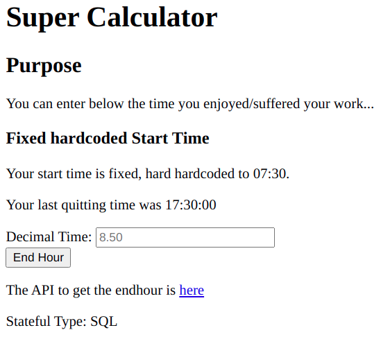
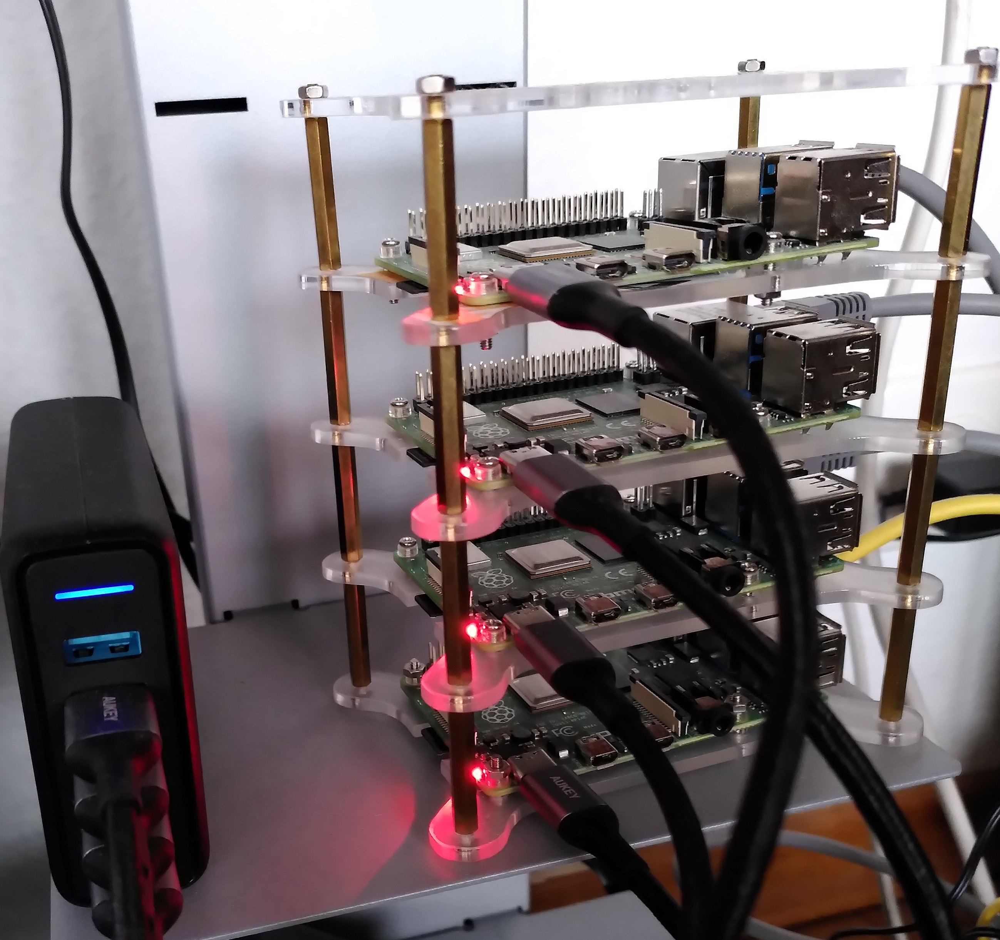
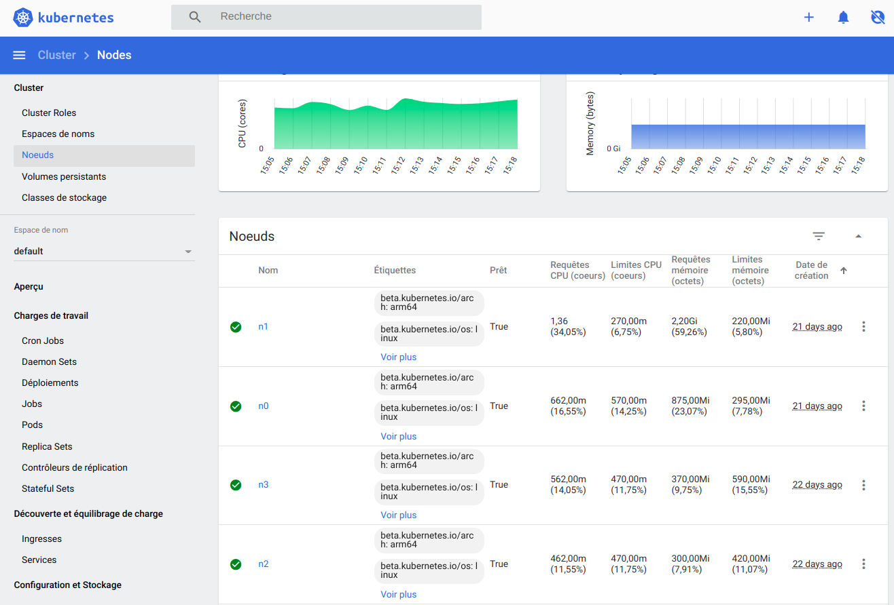

# Sample Kubernetes Service on Rapsberry PI-4

## Status: Draft

## Todo

- multi-architecture build for the stateful "file" version
- update the sql image with stateful-type displayed on html form

## History and Purpose

It's a little tool to calculate the arrival and leaving
time at work.
The working times by the client was the elapsed decimal time.
The accounting website of
my employer required a starting
and leaving time. As I spent too much time
entering my working times why not writing a little tool
and together get acquainted with Kubernetes and Go?
I wrote it first in Python, then in Go. This version for Kubernetes
is written in Python with Flask again because I don't know
the [`echo`](https://github.com/labstack/echo) Go equivalent
to Flask.

## Software Components

### Core Container Image

This image is defined in `Dockefile` and `Dockerfile_file`.

The first default Dockerfile uses SQL for persistence, whereas the other
uses a file. Each image matches the services `hoursservice` and
`hoursservice-file`.

Accessing the nodeport 30038 of the service *hours-service-file*
at e.g. `http://192.168.1.100:30038/` displays an html page with,
at the bottom, the stateful-type used.

The same holds for the other service *hours-service* at port 30036.

- Flask is used both for a formular and for the API; see `server.py`.
- Time calculation is implemented in `Hayshours`.
- Python abstract class `Persistable` defines the API to save data.
- Unittests define tests for calculation and persistence.
- They are two implementations with `FilePersist` and `SQLPersist`.
- Depending on variable `STATEFUL_TYPE` the `server.py`
  will get from `persistfactory` either a database or a
  file solution to save its data.

### Kubernetes Deployments

Two deployments match the two implementations of persistence:

1. Deployment with SQL persistence; it is defined in
   `deployment_raspi_sql.yaml`.

2. Deployment with file persistence; it is defined in
   `deployment_raspi_file.yaml`. The container image is smaller
   than the database version.

## Building the Home Cluster

The nodes are made of four Raspberry-PI with 128 Gb cards.
I tried with two nodes of 32 Gb and two of 16 Gb but the
small ones often crashed.

The image used is an Ubuntu one: `ubuntu-20.04.1-preinstalled-server-arm64+raspi.img.xz`.
The setup is explained both on [MicroK8s](https://microk8s.io/)
and on [Ubuntu](https://ubuntu.com/tutorials/how-to-kubernetes-cluster-on-raspberry-pi#1-overview).

Here is a picture of the cluster.

Once `kubectl proxy` is running we can access the dashboard.

### Node `n3` for Docker

I used this node to build raspberry pi container with `docker`.
Since I switch to multi-architecture with `docker buildx` and
don't need to use the pi any more.

It only requires a base multi-architecture OS and specifying
which architecture on command line:

``docker buildx build --platform linux/amd64,linux/arm/v7,linux/aarch64 --tag gaillardo/hayshoursrpi:sql-v4-mularch -f Dockerfile_arch --push .
``
It cannot be built locally. See a good tutorial [here](https://starkandwayne.com/blog/building-docker-images-for-kubernetes-on-arm/).

## Create a Virtualenv with Python3

Use `pip` with the `requests.txt` and virtualenv. *virtualenvwrapper* is very cool.
`mkvirtualenv venv-name`.
Then `workon` will list the virtualenvs and you can select `venv-name>`. See [virtualenvwrapper doc](https://virtualenvwrapper.readthedocs.io/en/latest/).

To install *MariaDB* client and `mysql-connector-python`
some special packages where required prior to use :
- `build-base`
- `python3-dev`
These packages are present in the first image only.
See the multi-stage build in the `Dockerfile`.

# Tests

To run all tests go in `python` directory and: `python -m unittest`.

To test the Docker image:

`docker run --env MARIAPASS=Passwd -it gaillardo/hayshoursrpi:test5 /bin/bash`

Inside the container within the `python` directory you
can run `python -m unittest`

To run separate test, you have to export `PYTHONPATH`
to the current path within `python` dir e.g. ``export PYTHONPATH=`pwd` ``

## Testing  the Service  `hours-service`

`test_server L|K`:

- `L` uses the `flask` server locally
- `K` uses the Kubernetes service

Per default the test uses Kubernetes.

## Version with Volume of Pod `hoursdata-pod`

The `hostPath` of `pod_raspi.yaml` defines a volume path `/home/ubuntu`
on the node running the pod. The `volumeMounts` set the mount
path to `/data` for the container image.

`kubectl exec hoursdata-pod ls /data` returns `db1`, which is the
fixed `dbname` defined in `server.py`.

`server.py` uses the environment variable `ROOTDIR` to use the
mount path set by the pod definition.

## Volume for MariaDB

The node `n3` is an nfs server whose exported directory is used as
Kubernetes volume. See the definitions here:
- `nfs-volume.yaml`
- `nfs-volume-claim.yaml`

I followed the setup from the book *Kubernetes Up & Running* from chapter
15 about storage solutions. In place of MySQL I used MariaDB to build
a *singleton* pod.

In the present implementation the test `test_stateful_withsql.py` will
connect to the MariaDB, create a database and one table, store leaving
hour as text. After the test the database is deleted.

# Note: Future Version

- The next version will use `StateFulSets` for database

- Configmap for MariaDB to create the database and its unique table
  (Now when the flask server starts it initializes the database.)

- Use K8S secret for database credentials.

### Flask template

- `form.html`

- `api.html`

## Github

[Hayshours source](https://github.com/OlivierGaillard/hayshoursrpi)
[Docker Hub](https://hub.docker.com/repository/docker/gaillardo/hayshoursrpi)
